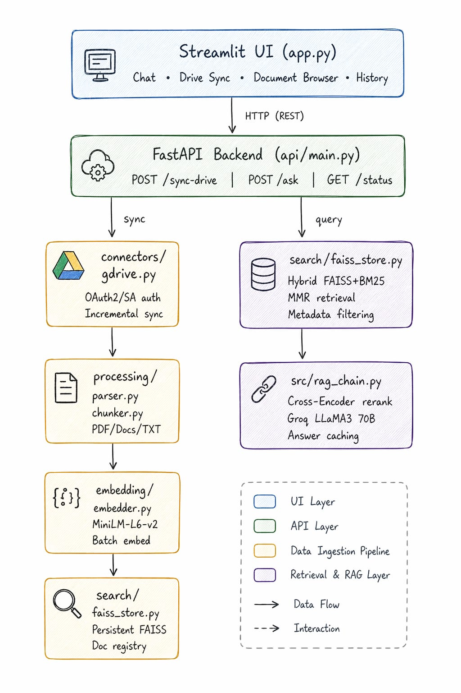

# DriveMind — RAG over Google Drive

> **Your personal ChatGPT over Google Drive.**
> Ask questions in plain English. Get answers grounded in your documents.

Built for the Highwatch AI Platform Engineer Trial Assignment.

---

## Archirecture




### Project Structure

```
docmind-drive-rag/
├── api/
│   ├── __init__.py
│   └── main.py              ← FastAPI app: /sync-drive, /ask, /status
├── connectors/
│   ├── __init__.py
│   └── gdrive.py            ← Google Drive OAuth2, incremental sync
├── processing/
│   ├── __init__.py
│   ├── parser.py            ← PDF/TXT/DOCX text extraction + cleaning
│   └── chunker.py           ← RecursiveCharacterTextSplitter + metadata
├── embedding/
│   ├── __init__.py
│   └── embedder.py          ← HuggingFace MiniLM-L6-v2, batch embedding
├── search/
│   ├── __init__.py
│   └── faiss_store.py       ← Persistent FAISS, hybrid retrieval, filtering
├── src/
│   ├── __init__.py
│   ├── rag_chain.py         ← Cross-Encoder rerank, Groq LLaMA3, caching
│   └── chat_history.py      ← Session persistence
├── credentials/             ← Google credentials (gitignored)
│   └── .gitkeep
├── faiss_store/             ← Persisted FAISS index (gitignored)
├── cache/                   ← Answer cache (gitignored)
├── chat_sessions/           ← Chat history (gitignored)
├── app.py                   ← Streamlit frontend
├── pyproject.toml
├── .env.example
└── README.md
```

---

## Setup

### 1. Clone and Install

```bash
git clone https://github.com/YOUR_USERNAME/docmind-drive-rag
cd docmind-drive-rag

# Using uv (recommended)
uv sync

# OR using pip
pip install -e .
```

### 2. Environment Variables

```bash
cp .env.example .env
# Edit .env and add your GROQ_API_KEY
```

Get a free Groq API key at: https://console.groq.com

### 3. Google Drive Credentials

**Option A: OAuth2 (Recommended for local dev)**

1. Go to [Google Cloud Console](https://console.cloud.google.com)
2. Create a new project (or select existing)
3. Enable **Google Drive API**: APIs & Services → Library → Search "Drive API" → Enable
4. Create OAuth credentials: APIs & Services → Credentials → Create Credentials → OAuth client ID
5. Select **Desktop app**, download the JSON
6. Rename to `credentials.json`, place in `credentials/` folder
7. First sync will open a browser window for consent — authenticate once, token is cached

**Option B: Service Account (For production / server deployment)**

1. APIs & Services → Credentials → Create Credentials → Service Account
2. Download the JSON key
3. Rename to `service_account.json`, place in `credentials/` folder
4. Share your Drive folder with the service account email (found in the JSON)

### 4. Run the System

**Terminal 1 — FastAPI Backend:**
```bash
uvicorn api.main:app --reload --host 0.0.0.0 --port 8000
```

**Terminal 2 — Streamlit Frontend:**
```bash
streamlit run app.py
```

Open http://localhost:8501 in your browser.

### 5. Sync and Query

1. Open the **Drive Sync** tab
2. Click **Start Sync** (optionally provide a folder ID)
3. Wait for sync to complete (first time downloads all files)
4. Switch to **Chat** tab and ask questions!

---

## API Reference

### `POST /sync-drive`

Fetch and index documents from Google Drive.

```json
// Request
{
  "folder_id": null,        // optional: limit to specific folder
  "force_full": false,      // if true: re-process all files
  "max_files": 200          // max files to consider
}

// Response
{
  "status": "success",
  "message": "Synced 12 new/updated file(s), skipped 8 unchanged, added 847 chunks.",
  "stats": {
    "total_on_drive": 20,
    "fetched": 12,
    "skipped_unchanged": 8,
    "chunks_added": 847,
    "processed_files": ["policy.pdf", "sop.docx", "handbook.txt"],
    "errors": [],
    "sync_time": "2026-04-23T14:30:00",
    "incremental": true
  }
}
```

### `POST /ask`

Answer a question from the knowledge base.

```json
// Request
{
  "query": "What are our company policies on compliance?",
  "chat_history": [],       // optional: previous Q&A for memory
  "use_cache": true         // cache repeated queries for 1hr
}

// Response
{
  "answer": "According to the compliance policy document, all employees must complete annual compliance training by Q1. The policy requires...",
  "sources": ["compliance_policy.pdf", "employee_handbook.docx"],
  "source_details": [
    {"file_name": "compliance_policy.pdf", "doc_id": "1abc...", "page": 3, "source": "gdrive"},
    {"file_name": "employee_handbook.docx", "doc_id": "2def...", "page": 7, "source": "gdrive"}
  ],
  "cached": false,
  "query": "What are our company policies on compliance?"
}
```

### `POST /ask/filtered`

Search within specific documents only.

```json
// Request
{
  "query": "What is our refund policy?",
  "file_names": ["refund_policy.pdf"],
  "chat_history": []
}
```

### `GET /status`

System status and index stats.

### `GET /documents`

List all indexed documents with chunk counts.

### `DELETE /cache`

Clear the answer cache (useful after re-syncing).

---

## Sample Queries and Outputs

### Query 1: Policy Question
```
POST /ask
{"query": "What is our refund policy?"}

Response:
{
  "answer": "The refund policy states that customers are eligible for a full 
             refund within 30 days of purchase. After 30 days, store credit 
             is issued. Damaged or defective items qualify for immediate 
             replacement regardless of purchase date.",
  "sources": ["refund_policy.pdf"],
  "source_details": [{"file_name": "refund_policy.pdf", "page": 2}]
}
```

### Query 2: SOP Question
```
POST /ask
{"query": "What are the steps for employee onboarding?"}

Response:
{
  "answer": "The onboarding process consists of 5 steps: 1) IT setup on Day 1,
             2) HR orientation on Day 1-2, 3) Department introduction Week 1,
             4) Training completion by Week 2, 5) 30-day check-in with manager.",
  "sources": ["onboarding_sop.docx", "hr_handbook.pdf"],
  "cached": false
}
```

### Query 3: Filtered Search
```
POST /ask/filtered
{
  "query": "What are the data retention requirements?",
  "file_names": ["data_privacy_policy.pdf"]
}

Response:
{
  "answer": "Per the data privacy policy, customer data must be retained for 
             7 years for compliance purposes. Personal data not required for 
             legal purposes must be deleted within 90 days of account closure.",
  "sources": ["data_privacy_policy.pdf"],
  "filtered_to": ["data_privacy_policy.pdf"]
}
```

### Incremental Sync Example
```
# First sync: downloads all 20 files
POST /sync-drive {}
→ "Synced 20 new files, skipped 0 unchanged, added 1,240 chunks"

# Second sync (next day, 2 files updated on Drive)  
POST /sync-drive {}
→ "Synced 2 new/updated files, skipped 18 unchanged, added 96 chunks"
# 18x faster than full re-sync!
```

---

## Design Decisions

### Why Hybrid Search (FAISS MMR + BM25)?

| Problem | Solution |
|---|---|
| Synonyms: "staff" vs "employees" | FAISS vector search understands meaning |
| Exact terms: "Section 4.2.1" | BM25 keyword search catches exact matches |
| Redundant results | MMR (Maximal Marginal Relevance) picks diverse chunks |

### Why Cross-Encoder Re-ranking?

FAISS embeds query and document **separately** — loses context between them. The cross-encoder reads both **together** in one pass, dramatically improving precision. We use `ms-marco-MiniLM-L-6-v2`, trained specifically for passage re-ranking.

### Why Incremental Sync?

On each `/sync-drive` call, we compare each Drive file's `modifiedTime` against a local manifest. Only changed files are re-downloaded and re-embedded. After initial sync, subsequent syncs are typically 10-20x faster.

### Why Caching?

Repeated queries (e.g. "what is the refund policy?" asked multiple times) hit the cache instantly without re-running retrieval + LLM. Cache TTL is 1 hour. Clear with `DELETE /cache` after re-syncing.

---

## Tech Stack

| Component | Technology |
|---|---|
| Backend API | FastAPI + Uvicorn |
| Frontend | Streamlit |
| Google Drive | google-api-python-client + OAuth2 |
| Embeddings | HuggingFace all-MiniLM-L6-v2 |
| Vector Store | FAISS (persistent) |
| Keyword Search | BM25 (rank-bm25) |
| Re-ranking | CrossEncoder ms-marco-MiniLM-L-6-v2 |
| LLM | Groq LLaMA3 70B (llama-3.3-70b-versatile) |
| PDF parsing | PyPDF |
| DOCX parsing | python-docx |
| Session storage | JSON files |
| Answer cache | JSON files (1hr TTL) |

---

## Evaluation Criteria Coverage

| Requirement | Implementation |
|---|---|
| ✅ Google Drive integration | OAuth2 + Service Account, `connectors/gdrive.py` |
| ✅ PDF/Docs/TXT support | `processing/parser.py` handles all 3 |
| ✅ POST /sync-drive | `api/main.py`, incremental + full sync |
| ✅ POST /ask with sources | Returns answer + sources list + page details |
| ✅ Good chunking strategy | 800 char / 150 overlap, recursive splitting |
| ✅ Relevant answers | Hybrid retrieval + cross-encoder re-ranking |
| ✅ Clean API design | FastAPI with Pydantic models, proper HTTP codes |
| ✅ Incremental sync | Manifest-based modifiedTime comparison |
| ✅ Caching | 1hr TTL JSON cache, DELETE /cache to clear |
| ✅ Metadata filtering | POST /ask/filtered by filename |
| ✅ Async pipeline | FastAPI async endpoints + executor for CPU work |
| ✅ Architecture folders | connectors/ processing/ embedding/ search/ api/ |
=======
# DriveMind — RAG over Google Drive

> **Your personal ChatGPT over Google Drive.**
> Ask questions in plain English. Get answers grounded in your documents.

Built for the Highwatch AI Platform Engineer Trial Assignment.

---

## Archirecture


### Project Structure

```
docmind-drive-rag/
├── api/
│   ├── __init__.py
│   └── main.py              ← FastAPI app: /sync-drive, /ask, /status
├── connectors/
│   ├── __init__.py
│   └── gdrive.py            ← Google Drive OAuth2, incremental sync
├── processing/
│   ├── __init__.py
│   ├── parser.py            ← PDF/TXT/DOCX text extraction + cleaning
│   └── chunker.py           ← RecursiveCharacterTextSplitter + metadata
├── embedding/
│   ├── __init__.py
│   └── embedder.py          ← HuggingFace MiniLM-L6-v2, batch embedding
├── search/
│   ├── __init__.py
│   └── faiss_store.py       ← Persistent FAISS, hybrid retrieval, filtering
├── src/
│   ├── __init__.py
│   ├── rag_chain.py         ← Cross-Encoder rerank, Groq LLaMA3, caching
│   └── chat_history.py      ← Session persistence
├── credentials/             ← Google credentials (gitignored)
│   └── .gitkeep
├── faiss_store/             ← Persisted FAISS index (gitignored)
├── cache/                   ← Answer cache (gitignored)
├── chat_sessions/           ← Chat history (gitignored)
├── app.py                   ← Streamlit frontend
├── pyproject.toml
├── .env.example
└── README.md
```

---

## Setup

### 1. Clone and Install

```bash
git clone https://github.com/YOUR_USERNAME/docmind-drive-rag
cd docmind-drive-rag

# Using uv (recommended)
uv sync

# OR using pip
pip install -e .
```

### 2. Environment Variables

```bash
cp .env.example .env
# Edit .env and add your GROQ_API_KEY
```

Get a free Groq API key at: https://console.groq.com

### 3. Google Drive Credentials

**Option A: OAuth2 (Recommended for local dev)**

1. Go to [Google Cloud Console](https://console.cloud.google.com)
2. Create a new project (or select existing)
3. Enable **Google Drive API**: APIs & Services → Library → Search "Drive API" → Enable
4. Create OAuth credentials: APIs & Services → Credentials → Create Credentials → OAuth client ID
5. Select **Desktop app**, download the JSON
6. Rename to `credentials.json`, place in `credentials/` folder
7. First sync will open a browser window for consent — authenticate once, token is cached

**Option B: Service Account (For production / server deployment)**

1. APIs & Services → Credentials → Create Credentials → Service Account
2. Download the JSON key
3. Rename to `service_account.json`, place in `credentials/` folder
4. Share your Drive folder with the service account email (found in the JSON)

### 4. Run the System

**Terminal 1 — FastAPI Backend:**
```bash
uvicorn api.main:app --reload --host 0.0.0.0 --port 8000
```

**Terminal 2 — Streamlit Frontend:**
```bash
streamlit run app.py
```

Open http://localhost:8501 in your browser.

### 5. Sync and Query

1. Open the **Drive Sync** tab
2. Click **Start Sync** (optionally provide a folder ID)
3. Wait for sync to complete (first time downloads all files)
4. Switch to **Chat** tab and ask questions!

---

## API Reference

### `POST /sync-drive`

Fetch and index documents from Google Drive.

```json
// Request
{
  "folder_id": null,        // optional: limit to specific folder
  "force_full": false,      // if true: re-process all files
  "max_files": 200          // max files to consider
}

// Response
{
  "status": "success",
  "message": "Synced 12 new/updated file(s), skipped 8 unchanged, added 847 chunks.",
  "stats": {
    "total_on_drive": 20,
    "fetched": 12,
    "skipped_unchanged": 8,
    "chunks_added": 847,
    "processed_files": ["policy.pdf", "sop.docx", "handbook.txt"],
    "errors": [],
    "sync_time": "2026-04-23T14:30:00",
    "incremental": true
  }
}
```

### `POST /ask`

Answer a question from the knowledge base.

```json
// Request
{
  "query": "What are our company policies on compliance?",
  "chat_history": [],       // optional: previous Q&A for memory
  "use_cache": true         // cache repeated queries for 1hr
}

// Response
{
  "answer": "According to the compliance policy document, all employees must complete annual compliance training by Q1. The policy requires...",
  "sources": ["compliance_policy.pdf", "employee_handbook.docx"],
  "source_details": [
    {"file_name": "compliance_policy.pdf", "doc_id": "1abc...", "page": 3, "source": "gdrive"},
    {"file_name": "employee_handbook.docx", "doc_id": "2def...", "page": 7, "source": "gdrive"}
  ],
  "cached": false,
  "query": "What are our company policies on compliance?"
}
```

### `POST /ask/filtered`

Search within specific documents only.

```json
// Request
{
  "query": "What is our refund policy?",
  "file_names": ["refund_policy.pdf"],
  "chat_history": []
}
```

### `GET /status`

System status and index stats.

### `GET /documents`

List all indexed documents with chunk counts.

### `DELETE /cache`

Clear the answer cache (useful after re-syncing).

---

## Sample Queries and Outputs

### Query 1: Policy Question
```
POST /ask
{"query": "What is our refund policy?"}

Response:
{
  "answer": "The refund policy states that customers are eligible for a full 
             refund within 30 days of purchase. After 30 days, store credit 
             is issued. Damaged or defective items qualify for immediate 
             replacement regardless of purchase date.",
  "sources": ["refund_policy.pdf"],
  "source_details": [{"file_name": "refund_policy.pdf", "page": 2}]
}
```

### Query 2: SOP Question
```
POST /ask
{"query": "What are the steps for employee onboarding?"}

Response:
{
  "answer": "The onboarding process consists of 5 steps: 1) IT setup on Day 1,
             2) HR orientation on Day 1-2, 3) Department introduction Week 1,
             4) Training completion by Week 2, 5) 30-day check-in with manager.",
  "sources": ["onboarding_sop.docx", "hr_handbook.pdf"],
  "cached": false
}
```

### Query 3: Filtered Search
```
POST /ask/filtered
{
  "query": "What are the data retention requirements?",
  "file_names": ["data_privacy_policy.pdf"]
}

Response:
{
  "answer": "Per the data privacy policy, customer data must be retained for 
             7 years for compliance purposes. Personal data not required for 
             legal purposes must be deleted within 90 days of account closure.",
  "sources": ["data_privacy_policy.pdf"],
  "filtered_to": ["data_privacy_policy.pdf"]
}
```

### Incremental Sync Example
```
# First sync: downloads all 20 files
POST /sync-drive {}
→ "Synced 20 new files, skipped 0 unchanged, added 1,240 chunks"

# Second sync (next day, 2 files updated on Drive)  
POST /sync-drive {}
→ "Synced 2 new/updated files, skipped 18 unchanged, added 96 chunks"
# 18x faster than full re-sync!
```

---

## Design Decisions

### Why Hybrid Search (FAISS MMR + BM25)?

| Problem | Solution |
|---|---|
| Synonyms: "staff" vs "employees" | FAISS vector search understands meaning |
| Exact terms: "Section 4.2.1" | BM25 keyword search catches exact matches |
| Redundant results | MMR (Maximal Marginal Relevance) picks diverse chunks |

### Why Cross-Encoder Re-ranking?

FAISS embeds query and document **separately** — loses context between them. The cross-encoder reads both **together** in one pass, dramatically improving precision. We use `ms-marco-MiniLM-L-6-v2`, trained specifically for passage re-ranking.

### Why Incremental Sync?

On each `/sync-drive` call, we compare each Drive file's `modifiedTime` against a local manifest. Only changed files are re-downloaded and re-embedded. After initial sync, subsequent syncs are typically 10-20x faster.

### Why Caching?

Repeated queries (e.g. "what is the refund policy?" asked multiple times) hit the cache instantly without re-running retrieval + LLM. Cache TTL is 1 hour. Clear with `DELETE /cache` after re-syncing.

---

## Tech Stack

| Component | Technology |
|---|---|
| Backend API | FastAPI + Uvicorn |
| Frontend | Streamlit |
| Google Drive | google-api-python-client + OAuth2 |
| Embeddings | HuggingFace all-MiniLM-L6-v2 |
| Vector Store | FAISS (persistent) |
| Keyword Search | BM25 (rank-bm25) |
| Re-ranking | CrossEncoder ms-marco-MiniLM-L-6-v2 |
| LLM | Groq LLaMA3 70B (llama-3.3-70b-versatile) |
| PDF parsing | PyPDF |
| DOCX parsing | python-docx |
| Session storage | JSON files |
| Answer cache | JSON files (1hr TTL) |

---

## Evaluation Criteria Coverage

| Requirement | Implementation |
|---|---|
| ✅ Google Drive integration | OAuth2 + Service Account, `connectors/gdrive.py` |
| ✅ PDF/Docs/TXT support | `processing/parser.py` handles all 3 |
| ✅ POST /sync-drive | `api/main.py`, incremental + full sync |
| ✅ POST /ask with sources | Returns answer + sources list + page details |
| ✅ Good chunking strategy | 800 char / 150 overlap, recursive splitting |
| ✅ Relevant answers | Hybrid retrieval + cross-encoder re-ranking |
| ✅ Clean API design | FastAPI with Pydantic models, proper HTTP codes |
| ✅ Incremental sync | Manifest-based modifiedTime comparison |
| ✅ Caching | 1hr TTL JSON cache, DELETE /cache to clear |
| ✅ Metadata filtering | POST /ask/filtered by filename |
| ✅ Async pipeline | FastAPI async endpoints + executor for CPU work |
| ✅ Architecture folders | connectors/ processing/ embedding/ search/ api/ |
